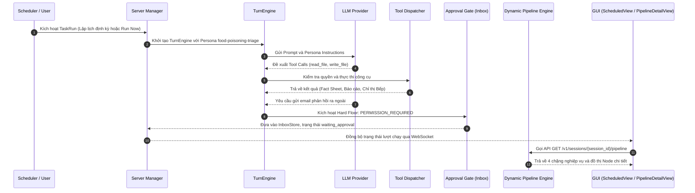

# Luồng Thực thi Toàn diện của Automation Workflow: Food Poisoning Triage

Tài liệu này mô tả chi tiết toàn bộ chu trình thực thi (End-to-End Execution Trace) của Automation Workflow **food-poisoning-triage**, bao gồm các tệp tin, lớp (class), hàm (function) và các điểm móc nối kiến trúc từ tầng Backend Scheduler đến Frontend GUI.

---

## 1. Sơ đồ Tổng quan Kiến trúc

---

## 2. Chi tiết từng Bước Thực thi trong Mã nguồn

### Bước 1: Kích hoạt Lượt chạy (Trigger & Scheduling)

#### 1. Kích hoạt theo Lịch trình định kỳ (Cron / Periodic Run)
- Tệp tin: [scheduler.py](file:///Users/mac/workspace/openworker/openworker/coworker/automation/scheduler.py)
  * Hàm `Scheduler.start()`: Khởi chạy coroutine vòng lặp ngầm `_loop()`.
  * Hàm `Scheduler._loop()`: Định kỳ mỗi 30 giây chạy `_tick()`.
  * Hàm `Scheduler._tick(trigger)`: Quét danh sách các tác vụ tự động hóa trong `TaskStore`. Nếu `task.is_due()` trả về `True`, hệ thống gọi hàm thực thi được ủy quyền `self.runner(task, trigger)`.

#### 2. Kích hoạt Thủ công (Manual Run Now)
- Tệp tin: [app.py](file:///Users/mac/workspace/openworker/openworker/coworker/server/app.py)
  * Endpoint `POST /v1/automations/{task_id}/run`: Nhận yêu cầu kích hoạt từ nút "Run now" trên giao diện người dùng và gọi `manager.run_automation_now(task_id)`.

#### 3. Khởi tạo Phiên làm việc Thực thi
- Tệp tin: [manager.py](file:///Users/mac/workspace/openworker/openworker/coworker/server/manager.py)
  * Hàm `Manager._run_scheduled_task(task, trigger)`:
    1. Tạo bản ghi `TaskRun(task_id=task.id, trigger=trigger)` với `session_id` độc lập.
    2. Lưu bản ghi vào `self.task_store.add_run(run)` với trạng thái `running`.
    3. Gửi thông báo WebSocket `automation_run_started` tới toàn bộ cửa sổ ứng dụng qua `self.broadcast_event()`.
    4. Gọi `self._build_task_engine(task, session_id=run.session_id)` để thiết lập phiên làm việc.

---

### Bước 2: Nạp Cấu hình Persona và Kỹ năng Nghiệp vụ

- Tệp tin: [manager.py](file:///Users/mac/workspace/openworker/openworker/coworker/server/manager.py)
  * Hàm `Manager._build_task_engine(task, session_id)`:
    1. Lấy thông tin đặc tả của Persona: `ag = get_agent(task.agent)`.
    2. Nạp cấu hình kỹ năng thông qua `effective_skill_names(session_id, workspace, agent)`.
    3. Nạp bộ công cụ cho phép từ các kết nối (connectors) khả dụng.
    4. Khởi tạo đối tượng `TurnEngine` từ hàm `build_engine()`.

- Tệp tin: [registry.py](file:///Users/mac/workspace/openworker/openworker/coworker/agents/registry.py)
  * Hàm `get_agent(name)`: Truy vấn Persona từ kho lưu trữ trung tâm: `get_registry().agent("food-poisoning-triage")`.

- Tệp tin: [manifest.md](file:///Users/mac/workspace/openworker/openworker/coworker/personas/builtin/food-poisoning-triage/manifest.md)
  * Định nghĩa toàn bộ logic nghiệp vụ, các kỹ năng tích hợp (`incident-scoring`, `insurance-dispatch`), biểu mẫu bồi thường PDF và khai báo cấu hình chặng pipeline trong phần YAML frontmatter.

- Tệp tin: [manifest.py](file:///Users/mac/workspace/openworker/openworker/coworker/personas/manifest.py)
  * Lớp `PersonaManifest`: Chịu trách nhiệm phân tích cú pháp YAML và ánh xạ trường `pipeline: Optional[dict[str, Any]]`.

---

### Bước 3: Vòng lặp Suy luận, Quét Hòm thư và Phân loại Nội dung (Agent Turn Loop)

- Tệp tin: [manager.py](file:///Users/mac/workspace/openworker/openworker/coworker/server/manager.py)
  * Dòng 6216: `async for _event in engine.run(opening): pass`: Đưa câu lệnh nhiệm vụ mở đầu vào `TurnEngine`.

- Tệp tin: [engine.py](file:///Users/mac/workspace/openworker/openworker/coworker/engine.py)
  * Hàm `TurnEngine.run(user_input)`:
    1. Chuẩn bị tin nhắn người dùng và phát sự kiện `EventType.TURN_START`.
    2. Khởi chạy coroutine `_loop()`.
  * Hàm `TurnEngine._loop()`:
    1. Nhận luồng suy luận (streaming chunks) từ LLM Provider qua `_astream()`.
    2. Phát các sự kiện gia tăng `EventType.REASONING_DELTA` và `EventType.ASSISTANT_DELTA`.
    3. Khi lượt trả lời của mô hình chứa danh sách lệnh gọi công cụ (`turn.tool_calls`), hàm chuyển tiếp sang `self._handle_tool_calls(turn.tool_calls)`.
  * Hàm `TurnEngine._handle_tool_calls(tool_calls)` thực thi quy trình tiếp nhận và phân loại:
    1. **Quét Hòm thư Gmail**: Agent gọi công cụ `gmail_search_messages` với truy vấn tổng quát `is:unread` (giới hạn 5 email), không áp dụng bộ lọc từ khóa cứng nhắc trong chuỗi tìm kiếm.
    2. **Đọc Chi tiết Từng Email**: Với các mã định danh email trả về, Agent gọi `gmail_get_message` để đọc tiêu đề, người gửi, nội dung thư và tệp đính kèm.
    3. **Phân loại Nội dung (Content Classification)**:
       - Hòm thư tiếp nhận nhiều thể loại email khác nhau (bản tin, tiếp thị, câu hỏi dịch vụ, hóa đơn nhà cung cấp).
       - Agent tự động phân tích và sàng lọc: các email không liên quan sẽ được bỏ qua an toàn.
       - Chỉ những email có nội dung nghi vấn khiếu nại về ngộ độc thực phẩm, đau bụng, buồn nôn sau khi ăn tại nhà hàng mới được đưa vào quy trình xử lý chuyên sâu.
    4. **Bóc tách Chứng cứ và Đánh giá**: Khi xác định đúng email sự vụ, Agent kích hoạt kỹ năng `incident-scoring` để bóc tách thông tin dùng bữa và đánh giá rủi ro (P0/P1/P2).
    5. Ghi nhận kết quả vào lịch sử hội thoại bằng `self._record_result(tool_call, result, status)`.

---

### Bước 4: Kiểm soát Rào chắn Con người (Hard Floor & Approval Gate)

- Tệp tin: [engine.py](file:///Users/mac/workspace/openworker/openworker/coworker/engine.py)
  * Hàm `TurnEngine._authorize(tool_call)`:
    1. Khi Agent muốn thực hiện các tác vụ phát tán thông tin ra bên ngoài (như gửi email, phát lệnh thay đổi hệ thống), hàm kiểm tra chính sách bảo mật qua `self.permissions.check_and_request(...)`.
    2. Nếu công cụ thuộc diện cần con người xác nhận, hàm phát sự kiện `EventType.PERMISSION_REQUIRED`.

- Tệp tin: [permissions.py](file:///Users/mac/workspace/openworker/openworker/coworker/permissions.py)
  * Lớp `PermissionManager`: Đảm bảo quy tắc bảo mật Hard Floor không thể bị vượt qua tự động.

- Tệp tin: [manager.py](file:///Users/mac/workspace/openworker/openworker/coworker/server/manager.py)
  * Hàm `Manager._scheduled_approver(task, session_id)`:
    1. Tiếp nhận sự kiện yêu cầu phê duyệt từ phiên chạy tự động.
    2. Tạo một mục chờ xử lý trong [InboxStore](file:///Users/mac/workspace/openworker/openworker/coworker/inbox.py).
    3. Phiên làm việc tạm dừng an toàn tại trạng thái `waiting_approval`.

---

### Bước 5: Bóc tách Dữ liệu Quy trình (Dynamic Pipeline Engine)

Khi người dùng mở chi tiết một lượt chạy trên giao diện, yêu cầu API được gửi tới Backend:

- Tệp tin: [app.py](file:///Users/mac/workspace/openworker/openworker/coworker/server/app.py)
  * Endpoint `GET /v1/sessions/{session_id}/pipeline` (dòng 1820):
    1. Xác thực mã truy cập an toàn của sidecar thông qua header `x-openworker-token`.
    2. Tải bản ghi phiên làm việc `SessionRecord` và toàn bộ lịch sử tin nhắn `messages`.
    3. Gọi hàm `extract_pipeline(session, messages, persona_registry=manager.personas)`.

- Tệp tin: [engine.py](file:///Users/mac/workspace/openworker/openworker/coworker/personas/pipelines/engine.py)
  * Hàm `extract_pipeline()`:
    1. Nhận diện cấu hình: Kiểm tra trường `pipeline` trong `manifest.md` của Persona.
    2. Với `food-poisoning-triage`, hệ thống điều phối qua hàm `_extract_schema_driven_pipeline()`:
       - **Chặng 1 (Intake & Evidence Extraction)**: Phân tích các lệnh đọc email hoặc tệp tin để bóc tách thông tin khách hàng, ngày giờ dùng bữa, món ăn, thời gian ủ bệnh, triệu chứng lâm sàng và danh sách chứng từ đính kèm.
       - **Chặng 2 (Severity Scoring)**: Trích xuất cấp độ rủi ro (P0-CRITICAL, P1-HIGH, P2-STANDARD) cùng các chỉ thị an toàn nhà bếp theo tiêu chuẩn HACCP và benchmark dịch tễ CDC/FDA (niêm phong mẫu thực phẩm lưu retention samples, rà soát nhật ký nhiệt độ kho lạnh).
       - **Chặng 3 (Insurance Claim Draft & Form)**: Trích xuất toàn văn bản thảo thư phản hồi tiếng Anh chuẩn nghiệp vụ bảo hiểm trách nhiệm pháp lý thương mại (Commercial General Liability, nguyên tắc Without Admission of Liability) và đính kèm biểu mẫu bồi thường sự vụ Incident Claim Form dạng PDF.
       - **Chặng 4 (Human Approval Gate)**: Đọc trạng thái của cổng phê duyệt con người (đang chờ duyệt hay đã chấp thuận).
    3. Đồng thời, hàm tự động sinh ra danh sách `nodes` (gồm Node Trigger, Node Tool, Node Script, Node Human Gate, Node Artifact) phục vụ cho chế độ xem đồ thị kỹ thuật.

---

### Bước 6: Trình bày và Tương tác trên Giao diện Người dùng (Frontend GUI)

- Tệp tin: [api.ts](file:///Users/mac/workspace/openworker/openworker/surfaces/gui/src/api.ts)
  * Khai báo các giao diện kiểu dữ liệu TypeScript: `PipelineStage`, `PipelineNode`, `PipelineRunDetail`.
  * Hàm `getPipelineDetails(sessionId, machineId)`: Gửi HTTP GET request với header `x-openworker-token` lấy dữ liệu pipeline có cấu trúc từ backend.

- Tệp tin: [ScheduledView.tsx](file:///Users/mac/workspace/openworker/openworker/surfaces/gui/src/components/ScheduledView.tsx)
  * Khi người dùng nhấp vào một dòng trong bảng lịch sử lượt chạy (Runs) của Automation:
    1. Cập nhật trạng thái `selectedPipelineSessionId`.
    2. Thay vì chuyển hướng người dùng sang giao diện Chat đơn thuần, hệ thống kích hoạt component `PipelineDetailView`.

- Tệp tin: [PipelineDetailView.tsx](file:///Users/mac/workspace/openworker/openworker/surfaces/gui/src/components/PipelineDetailView.tsx)
  * Hàm `PipelineDetailView()`:
    1. Tải dữ liệu chi tiết của lượt chạy thông qua `getPipelineDetails`.
    2. Cung cấp bộ chuyển đổi chế độ xem đa năng:
       - **Chế độ Chặng nghiệp vụ (Stages View)**: Hiển thị thanh tiến trình 4 chặng với trạng thái thời gian thực, bảng dữ liệu chứng cứ, chỉ thị bếp HACCP, khung xem trước thư Đức và nút duyệt bồi thường.
       - **Chế độ Đồ thị thực thi (Execution Graph)**: Hiển thị danh sách các Node thực thi tuần tự kèm màu sắc phân loại trực quan.
    3. Chức năng Deep Inspector: Nhấp vào nút "Inspect" trên mỗi Node để mở rộng khung xem chi tiết tham số đầu vào (`inputs`) và dữ liệu kết quả (`outputs`) dạng JSON.
    4. Nút "View chat log" cho phép người dùng chuyển sang xem toàn bộ hội thoại thô bất cứ lúc nào nếu cần đối soát thêm.
